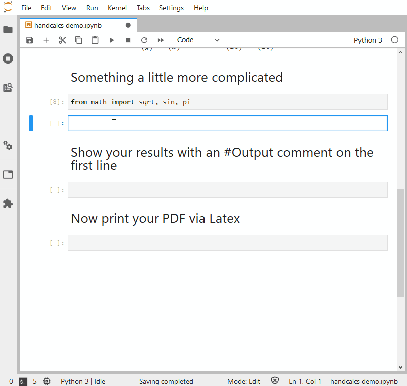
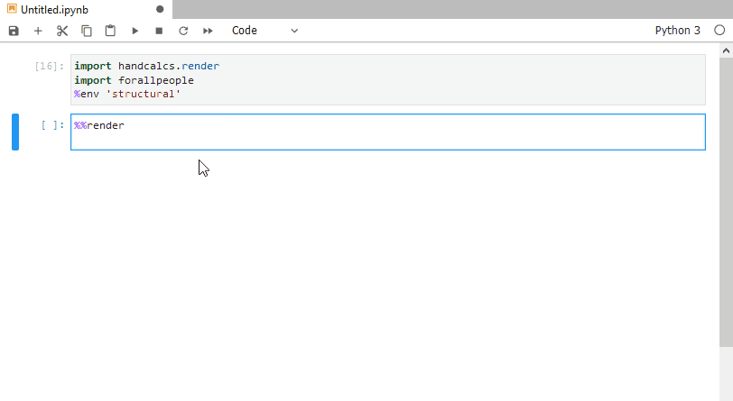
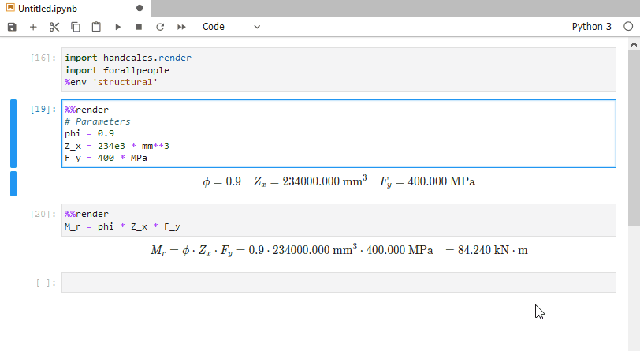
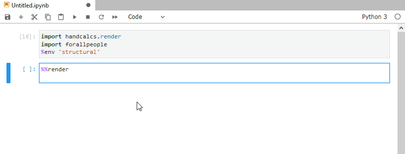
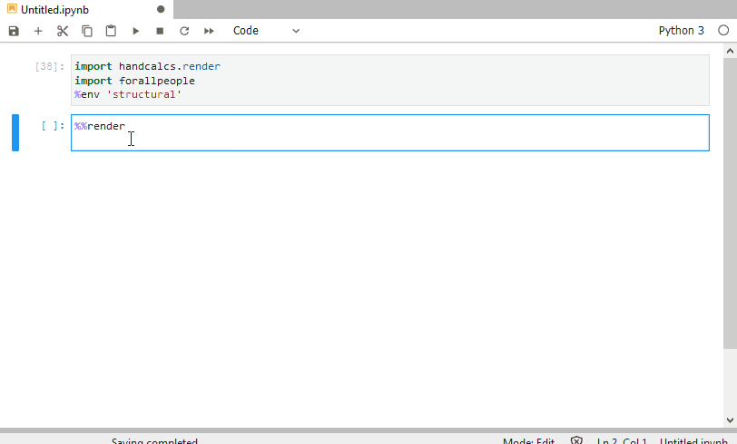
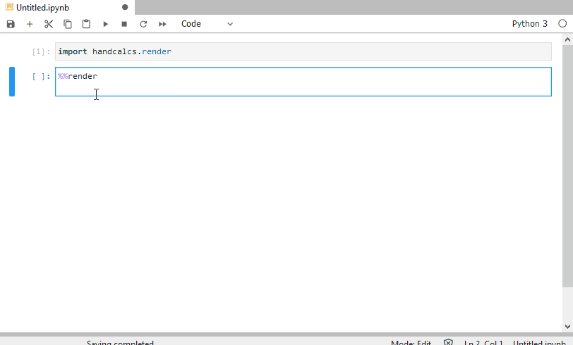

# handcalcs: Python calculations in Jupyter, as though you wrote them by hand.

`handcalcs` is a library to render your python calculation code automatically in Latex, but in a manner that mimics how one might format their calculation if it were written with a pencil:  write the symbolic formula, **followed by numeric substitutions**, and then the result.

Because `handcalcs` shows the numeric substitution, the calculations become significantly easier to check and verify by hand.

## Demos

### Basic Usage


### Exporting to PDF



## Installing

You can install using pip:

`pip install handcalcs`

## Basic Usage
`handcalcs` is intended to be used with either Jupyter Notebook or Jupyter Lab as a _cell magic_.

First, import the module and run the cell:

```python
import handcalcs.render
```

Alternatively, you can load `handcalcs` as a Jupyter extension:

```python
%load_ext render
```

Then, in any cell that you want to render with `handcalcs`, just use the render cell magic at the top of your cell:

```python
%%render
```

For example:

```python
%%render
a = 2
b = 3
c = 2*a + b/3
```

That is it!

Once rendered, you can then export your notebook as a PDF, if you have a Latex environment installed on your system. If you are new to working with Latex and would like to install it on your system so you can use this functionality, please see the section Installing Tex, below.

## Enhanced Usage

`handcalcs` makes certain assumptions about how you would like your calculation formatted and does not allow for a great deal of customization in this regard. However, there are currently **three** customizations you can make using `# comment tags` as the _first line of your cell_ after the `%%render` cell magic. You can only use __one__ comment tag per cell.

* `# Parameters`: `handcalcs` renders lines of code vertically, one after the other. However, when you are assigning variables, i.e. establishing your calculation "parameters", you may not want to waste all of that vertical space. Using the `# Parameters` (also `# parameters`, `#parameters`, `#  Parameters`, etc.) comment tag, your list of parameters will instead render in three columns, thereby saving vertical space.


* `# Output`: In order to render a line of calculations, `handcalcs` relies upon code in the form `parameter = expression`. However, if you just want to display values of a series of parameters that you have previously calculated, you can't create a new expression to assign to them. Using the `# Output` tag (also `#output`, `#out`, or `# Out`) will render all variables in your cell (each individual variable has to be on its own separate line) with their current values.


* `# Long`: To save vertical space, `handcalcs` _attempts_ to figure out how long your calculation is and, if it is short enough, render it out fully on one line. e.g. `c = 2*a + b/3 = 2*(2) + 3/(3) = 5`. If `handcalcs`'s internal test deems the calculation as being too long to fit onto one line, it breaks it out into multiple lines. Using the `# Long` (also `#long` or `#Long`, you get the idea) comment tag overrides the length check and displays the calculation in the "Long" format by default. e.g.

    ```python
    # From this:
    c = 2*a + b/3 = 2*(2) + (3)/3 = 5

    # To this:
    c = 2*a + b/3
      = 2*(2) + (3)/3
      = 5
    ```

## Units Packages Compatibility

`handcalcs` was designed to be used with the units package, `forallpeople` (and `forallpeople` was designed to be compatible with `handcalcs`). 



Other units packages can be used to similar effect provided they do the following:

1. Define a `_repr_latex_()` method
2. Auto-reduce dimensions (i.e. you don't have to call an extra method on the resulting object to have the resulting quantity render itself the way you intend)

However, if you are using a units package that does not auto-reduce, it should still be compatible but the output will not be as clean and intuitive.

### Get Just the Latex Code, without the render
If you just want to generate the rendered Latex code directly to use in your own Latex files, you can use the `%%tex` cell magic, instead:

```python
%%tex
a = 2
b = 3
c = 2*a + b/3
```

Then you can just copy and paste the result into your own .tex document.



## Features

Here's what you can do right now. If the community is interested in more features that I have not thought of, then maybe there could be more.

### Subscripts (and sub-subscripts, etc.)

Subscripts in variable names are automatically created when `_` is used in the variable name. Sub-subscripts are nested for each separate `_` used in series.


### Greek symbols

Any variable name that contains a Greek letter (e.g. "pi", "upsilon", "eta", etc.) as a string or substring will be replaced by the appropriate Latex code to represent that Greek letter.

Using lower case letters as your variable name. Using capitalized names will render as upper case.



### Functions, built-in or custom

If you are using python functions in your calculation, eg. `min()` or `sin()`, they will be replaced with Latex code to represent that function in Latex



### Rendered in-line Comments

Any comments placed after a line of calculation will be rendered as an inline comment in the Latex. This makes it convenient to make notes along side your calculations to briefly explain where you may have gotten/chosen a particular value.



### Skip the substitution

Any calculation entirely wrapped in parentheses, `()`, will be rendered as just `param = result`, without the substitution. This can be convient when you want to calculate a parameter on the fly and not have it be the focus of the calculation.

### Conditional statements

Many calculations in the "real world" are dependent on context: you would do this if it's like that, and this other way if its not.

`handcalcs` allows for the inclusion of some simple conditional statements into its code in a way that makes it easier to understand the context of the calculation.

*Note: While less pythonic, all expressions following the conditional must be on the same line (separated with `;`, if required).*

### Numeric integration

You can use `scipy.quad` to perform numeric integration on a pre-defined function and have `handcalcs` perform a basic rendering of it.


##  Expected Behaviours

`handcalcs` is intended to render arithmetical calculations written in python code. It is not intended to render arbitrary python into Latex. Given that, handcalcs only renders a small subset of python and there is a lot that will not work, especially anything that happens over multiple lines (e.g. function definitions, `for` loops, `with` statements, etc.).

`handcalcs` works by parsing individual _lines_ of python within a cell. It does not parse the cell as a whole. Therefore all statements to be rendered must be contained on a single line.

### Accepted datatypes

Objects are rendered into Latex by two main approaches:

1. If the object has a `_repr_latex_()` method, then that method is used.

    a) If the object has some alternate method for rendering itself into Latex code, an attempt is made to find that (e.g. `.latex()` or `.to_latex()` will be attempted), also. In order for the representation to be rendered properly, the object has to use Latex commands that are implemented with MathJax and/or Katex.
2. If the object does not have a Latex method, then `str()` is used.

If you are using object types that have str methods that render as `<MyObject: value=34>`, then that's what the Latex interpreter will see.

### Arithmetic operators

* `+` renders as `+`
* `-` renders as `-`
* `*` renders as the "dot operator" (Latex: \cdot)
* `/` always renders as a fraction
* `**` renders as superscripts
* `%` renders as the "mod function" (Latex: \mod)

Currently, `//` is not rendered but you can easily use `math.floor` as a function, instead.

### Brackets (parentheses) are critical

Brackets are used to remove ambiguity in how the Latex is rendered. For example:

```python
a = 42
b = 32
c = (3*a)/(sqrt(2*a + b**2))
```
Here, brackets are used to define both the numerator and denominator, unambiguously.

However, the below will produce unexpected results:

```python
a = 42
b = 32
c = (3*a)/sqrt(2*a + b**2)
```

While the resulting value will still be the correct one, `handcalcs` sees the above approximately as:

```python
c = (3*a)/sqrt * (2*a + b**2)
```

Under-the-hood, parsed python code in `handcalcs` is represented as a nested deque: every set of parentheses (no matter the context) begins a new nested deque which is recursively converted to Latex code. The above line would look like this (represented as a list for brevity): `[[3, '*', 'a'], '/', 'sqrt', [2, '*', 'a', '+', 'b', '**', '2' ]]`. Notice how the 'sqrt' is all alone after the `/` operator?

To render the fraction properly, a lookahead is performed and the next item after the `/` is rendered as the denominator. In this instance, the next item is the function name, `sqrt`, and not the full expression. Putting brackets around the whole denominator means that `handcalcs` will see the whole expression (as a nested deque) in the lookahead.

**If you have Latex output that looks not quite right, check to see if you are using brackets and fractions in this unambiguous manner.**

All actual calculations are handled by Jupyter when the cell is run. The resulting values are stored in the user's namespace dictionary and `handcalcs` uses the variable's corresponding value from the dict as the result to display. 


### `for` loops and other iterations

Showing rendered iterations is not supported. The intention for use is that you perform your iterations in a cell that is not rendered and then, once the iteration has produced the desired resulting value, then you render the result in a separate cell.

## Gotchas

Because `handcalcs` is designed for use within the Jupyter environment, and because Jupyter cells can be run out of order, there exists the possibility of having a big mess of beautifully rendered but **completely incorrect** calculations if you _re-use variable names throughout your notebook_.

This happens because `handcalcs` uses the notebook's user namespace dictionary to look up values for all variables in the namespace. If your calculations are re-using variable names throughout the notebook, then the dictionary entry for that name may not be what you think it is when you run cells out of the order that you intended.

You _can_ re-use variable names to good effect throughout a notebook, _IFF_ the cells are run in the correct order (easier if this is just top to bottom). 

`<gif example to follow>`

**On this note: if you are using `handcalcs` for any kind of reporting that may become a legal document (e.g. design engineering calculations), it is up to YOU to ensure that the results are what you expect them to be. `handcalcs` is free and open-source software and the author(s) are not responsible for incorrect calculations that result from its use.**

That being said, the very purpose for the way `handcalcs` renders its math is to make it very easy to confirm and verify calculations by hand.


## This seems like a lot of effort to write yet _another_ software to render math. Haven't you ever heard of Excel/Maple/MathCAD/Mathematica/MATLAB/Octave/SMATH Studio?

SMath Studio is excellent software and I highly recommend it. Octave is also great.

The others are all proprietary. 

They do not show numeric substitutions. 

They do not auto-format your calculations. 

They are not as extensible as `handcalcs` because they are not a part of the amazing python eco-system <3

As far as I have seen, `handcalcs` is the only software that does what it does (but I would like to be wrong about this).

## Printing to PDF in Jupyter

### Input only Templates

### Installing Latex

Printing to PDF requires you to have a Latex environment installed
on your system and to have a Latex compiler available on your system's `PATH` variable so Jupyter can execute `xelatex` on a command line.

Following an installation, you can open up a command line on your system and type `xelatex`. If the installation was successful and complete, the command will enter you into a Latex prompt instead of generating an error message.

### Latex for Windows

Installation on Windows is easiest by installing the TeX distribution, [MiKTeX](https://miktex.org/howto/install-miktex).
After installation, ensure that you allow automatic downloading of required
to make operation easiest.

### Latex for OSX

Installation on Mac OS X is easiest by installing [MacTeX](http://www.tug.org/mactex/mactex-download.html).

Be sure to read the installation page to prevent/assist with any issues.

### Latex for Linux

`$ sudo apt install texlive-latex-extra`
