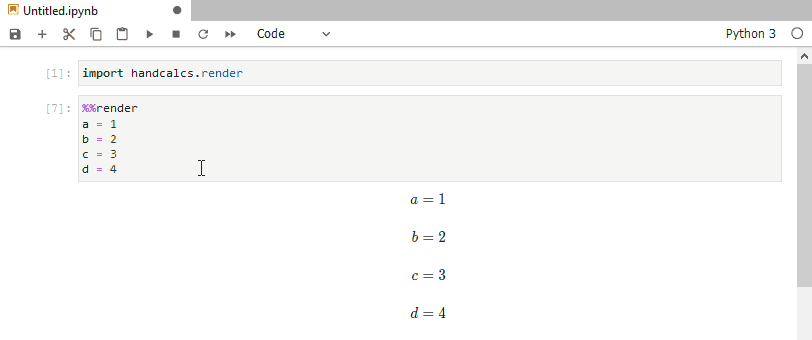
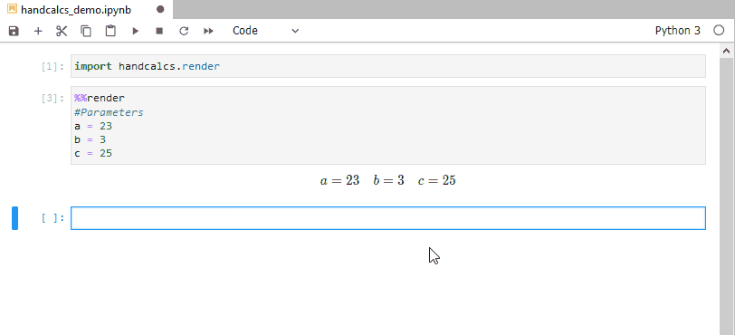
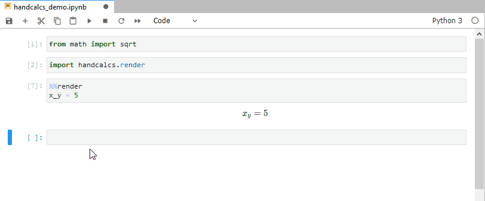
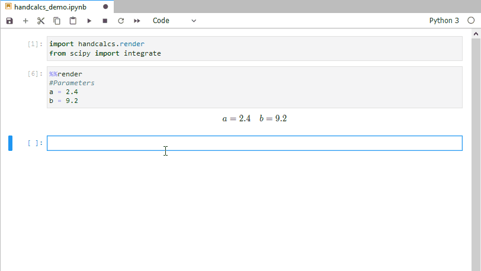
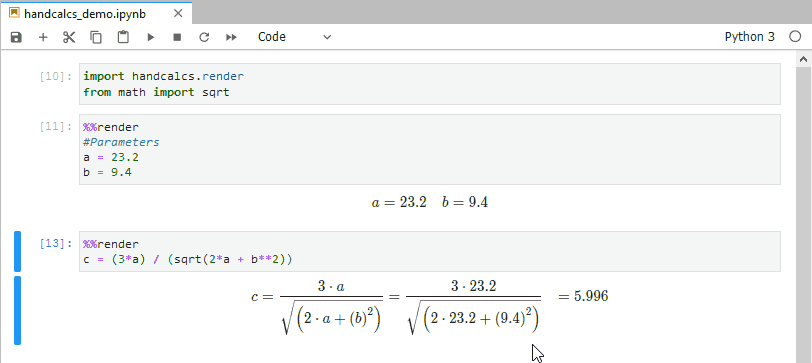

<p align="center">
  <br>
  Covert art by <a href = "https://www.instagram.com/joshuahoibergtattoos/">Joshua Hoiberg</a>
</p>

<h1 align = "center">handcalcs:<br>Python calculations in Jupyter,<br>as though you wrote them by hand.</h1>

`handcalcs` is a library to render your Python calculation code automatically in Latex, but in a manner that mimics how one might format their calculation if it were written with a pencil:  write the symbolic formula, **followed by numeric substitutions**, and then the result.

Because `handcalcs` shows the numeric substitution, the calculations become significantly easier to check and verify by hand.


## Contents

* [Basic Demo](https://github.com/connorferster/handcalcs#basic-demo)
* [Installation](https://github.com/connorferster/handcalcs#installing)
* [Basic Usage](https://github.com/connorferster/handcalcs#basic-usage)
* [Enhanced Usage](https://github.com/connorferster/handcalcs#enhanced-usage)
* [Features](https://github.com/connorferster/handcalcs#Features)
* [Expected Behaviours](https://github.com/connorferster/handcalcs#expected-behaviours)
* [Gotchas and Disclaimer](https://github.com/connorferster/handcalcs#gotchas)
* [Applications and Compatibility with Other Libraries (wiki)](https://github.com/connorferster/handcalcs/wiki)


## Basic Demo


## Installing

You can install using pip:

`pip install handcalcs`

## Basic Usage 1: As a Jupyter cell magic (`%%render`)
`handcalcs` is intended to be used with either Jupyter Notebook or Jupyter Lab as a _cell magic_.

First, import the module and run the cell:

```python
import handcalcs.render
```

Then, in any cell that you want to render with `handcalcs`, just use the render cell magic at the top of your cell:

```python
%%render
```

For example:

```python
%%render
a = 2
b = 3
c = 2*a + b/3
```

**That is it!**

Once rendered, you can then export your notebook as a PDF, provided you have a Latex environment installed on your system. If you are new to working with Latex and would like to install it on your system so you can use this functionality, please see the section [Installing Tex](https://github.com/connorferster/handcalcs/wiki), in the wiki.

## Basic Usage 2: As a decorator on your functions (`@handcalc`)

This is the same kind thing except instead of running your code in a Jupyter cell, you are running your code in a Python function, which is treated like a Jupyter cell. 

For example, start by importing the `@handcalc` decorator:

```python
from handcalcs import handcalc
```

Then, write your function. Your function MUST `return locals()`:

```python
@handcalc
def my_calc(x, y, z):
  a = 2*x / y
  b = 3*a
  c = (a + b) / z
  return locals()
```

Everything between `def my_calc(...)` and `return locals()` is now like the code in a Jupyter cell, except it's a standard Python function.

Now, when called, your function will return a 2-tuple consisting of

1. A str of the function code rendered as latex code
2. A dictionary of all of the variables in your function (the `locals()` dict).

```python
my_latex_code_str, locals_dict = my_calc(3,4,5)
```

Used in this way, you can use `handcalc` to dynamically generate Latex code for display in both Jupyter and other non-Jupypter Python environments (e.g. matplotlib, streamlit, )

## Comment Tags

`handcalcs` makes certain assumptions about how you would like your calculation formatted and does not allow for a great deal of customization in this regard. However, there are currently **three** customizations you can make using `# comment tags` as the _first line of your cell_ after the `%%render` cell magic. You can only use __one__ comment tag per cell.

**Comment tags can be used with both the Jupyter cell magic and the function decorator**. To use a comment tag with the decorator, the comment tag must be the first line after the signature (i.e. the `def func_name():`)

### `# Parameters`: 
`handcalcs` renders lines of code vertically, one after the other. However, when you are assigning variables, you may not want to waste all of that vertical space. 

Using the `# Parameters` comment tag, your list of parameters will instead render in three columns, thereby saving vertical space.



### `# Output`: 
In order to render a line of calculations, `handcalcs` relies upon code in the form `parameter = expression`. 

However, if you just want to display values of a series of parameters that you have previously calculated, use the `# Output` comment tag to display them.


### `# Long`: 
To save vertical space, `handcalcs` _attempts_ to figure out how long your calculation is and, if it is short enough, render it out fully on one line.

If `handcalcs`'s internal test deems the calculation as being too long to fit onto one line, it breaks it out into multiple lines. 

Use the `# Long` comment tag to override the length check and display the calculation in the "Long" format by default. e.g.

```python
    # From this:
    c = 2*a + b/3 = 2*(2) + (3)/3 = 5

    # To this:
    c = 2*a + b/3
      = 2*(2) + (3)/3
      = 5
```



---

## Units Packages Compatibility

`handcalcs` was designed to be used with the units package, [forallpeople](https://github.com/connorferster/forallpeople) (and [forallpeople](https://github.com/connorferster/forallpeople) was designed to be compatible with `handcalcs`). 


**For potential compatibility with other units packages, please see [the wiki.](https://github.com/connorferster/handcalcs/wiki)**

---

## Features

### Get Just the Latex Code, without the render
If you just want to generate the rendered Latex code directly to use in your own Latex files, you can use the `%%tex` cell magic, instead:

```python
%%tex
a = 2
b = 3
c = 2*a + b/3
```

Then you can just copy and paste the result into your own .tex document.


---

### Subscripts (and sub-subscripts, etc.)

Subscripts in variable names are automatically created when `_` is used in the variable name. Sub-subscripts are nested for each separate `_` used in series.


----

### Greek symbols

Any variable name that contains a Greek letter (e.g. "pi", "upsilon", "eta", etc.) as a string or substring will be replaced by the appropriate Latex code to represent that Greek letter.

* Using lower case letters as your variable name will make a lower case Greek letter.

* Using a Capitalized Name for your variable will render as an upper case Greek letter.


---

### Functions, built-in or custom

If you are using Python functions in your calculation, eg. `min()` or `tan()`, they will be replaced with Latex code to represent that function in Latex.

If you are making up your own functions, then they will be rendered in Latex as a custom operator.

If you are using a function with the name `sqrt` (whether your own custom implementation or from `math.sqrt`), then it will be rendered as the radical sign.


---

### Rendered in-line Comments

Any comments placed after a line of calculation will be rendered as an inline comment in the Latex. 

This makes it convenient to make notes along side your calculations to briefly explain where you may have gotten/chosen a particular value.


---

### Skip the substitution

Any calculation entirely wrapped in parentheses, `()`, will be rendered as just `param = result`, without the substitution. 

This can be convient when you want to calculate a parameter on the fly and not have it be the focus of the calculation.


---

### Conditional statements

Many calculations in the "real world" are dependent on context.

`handcalcs` allows for the inclusion of some simple conditional statements into its code in a way that makes it easier to understand the context of the calculation.



*Note: Multiple "lines" of calculations can be used after the conditional expression provided that they are all on the same line and separated with "`;`". See [Expected Behaviours](https://github.com/connorferster/handcalcs#expected-behaviours) for more context.*

---

### Numeric integration

You can use `scipy.quad` to perform numeric integration on a pre-defined function and have `handcalcs` perform a basic rendering of it.

This behaviour is triggered and attempted if you use a function with either `integrate` or `quad` in the name.



---

##  Expected Behaviours

`handcalcs` is intended to render arithmetical calculations written in Python code. It is not intended to render arbitrary Python into Latex. 

Given that, handcalcs only renders a small subset of Python and there is a lot that will not work, especially anything that happens over multiple lines (e.g. function definitions, `for` loops, `with` statements, etc.).

`handcalcs` works by parsing individual _lines_ of Python within a cell. It does not parse the cell as a whole. Therefore all statements to be rendered must be contained on a single line.

### Accepted datatypes

`handcalcs` will make an attempt to render all datatypes. However it is not intended for "collections"-based types (e.g. `list`, `tuple`, `dict`, etc.)

Objects are rendered into Latex by two main approaches:

1. If the object has a `_repr_latex_()` method defined, then that method is used.

    a) If the object has some alternate method for rendering itself into Latex code, an attempt is made to find that (e.g. `.latex()` or `.to_latex()` will be attempted), also. 
    
    In order for the representation to be rendered properly, the object's Latex represention must use commands that are implemented with MathJax and/or Katex.
2. If the object does not have a Latex method, then `str()` is used.

If you are using object types that have str methods that render as `<MyObject: value=34>`, then that's what the Latex interpreter will see and attempt to render.

### Arithmetic operators

* `+` renders as `+`
* `-` renders as `-`
* `*` renders as the "dot operator" (Latex: \cdot)
* `/` always renders as a fraction
* `**` renders as superscripts
* `%` renders as the "mod function" (Latex: \mod)

Currently, `//` is not rendered but you can easily use `math.floor` as a function, instead.

### Brackets (parentheses) are critical

Brackets are used to remove ambiguity in how the Latex is rendered. For example:

```python
a = 23.2
b = 9.4
c = (3*a)/(sqrt(2*a + b**2))
```
Here, brackets are used to define both the numerator and denominator, unambiguously.

However, even though it is correct and valid Python, the below will produce unexpected results:

```python
a = 23.2
b = 9.4
c = (3*a)/sqrt(2*a + b**2)
```


Under-the-hood, parsed Python code in `handcalcs` is represented as a nested deque: every set of parentheses (no matter the context) begins a new nested deque which is recursively converted to Latex code. 

The above line would look like this (represented as a list, for brevity): `[[3, '*', 'a'], '/', 'sqrt', [2, '*', 'a', '+', 'b', '**', '2' ]]`. Notice how the `sqrt` is all alone after the `/` operator?

To render the fraction properly, a lookahead is performed and the next item after the `/` is rendered as the denominator. In this instance, the next item is the function name, `sqrt`, and not the full expression. 

Putting brackets around the whole denominator means that `handcalcs` will see the whole expression (as a nested deque) in the lookahead.

**If you have Latex output that does not look quite right, check to see if you are using brackets and fractions in this unambiguous manner.**

All actual calculations are handled by Jupyter when the cell is run. The resulting values are stored in the user's namespace dictionary and `handcalcs` uses the variable's corresponding value from the namespace dict as the result to display. This means that, even if the representation of your calculation appears funny, the result will be correct _provided that you are using a unique variable name._ (see, [Gotchas](https://github.com/connorferster/handcalcs#gotchas))


### `for` loops and other iterations

Showing rendered iterations is not supported. The intention for use is that you perform your iterations in a cell that is not rendered and then, once the iteration has produced the desired resulting value, then you render the result in a separate cell.

## Gotchas

Because `handcalcs` is designed for use within the Jupyter environment, and because Jupyter cells can be run out of order, there exists the possibility of having a big mess of beautifully rendered but **completely incorrect** calculations if you _re-use variable names throughout your notebook_.

`handcalcs` uses the notebook's user namespace dictionary to look up values for all variables in the namespace. If your calculations are re-using variable names throughout the notebook, then the dictionary entry for that name may not be what you think it is when you run cells out of the order originally intended.

You _can_ re-use variable names to good effect throughout a notebook, _IFF_ the cells are run in the correct order (easier if this is just top to bottom). 

**On this note: if you are using `handcalcs` for any kind of reporting that may become a legal document (e.g. design engineering calculations), it is up to YOU to ensure that the results are what you expect them to be. `handcalcs` is free and open-source software and the author(s) are not responsible for incorrect calculations that result from its use.**

That being said, the very purpose for the way `handcalcs` renders its math is to make it very easy to confirm and verify calculations by hand.

## Applications and Compatibility with OPP (Other People's Packages)

** Please see [the wiki](https://github.com/connorferster/handcalcs/wiki) for applications of `handcalcs` in education and engineering, in addition to examples of using `handcalcs` with other Python libraries such [streamlit](https://github.com/connorferster/handcalcs/wiki/Handcalcs-on--Streamlit) and [papermill](https://github.com/connorferster/handcalcs/wiki/Handcalcs-on-Papermill).
