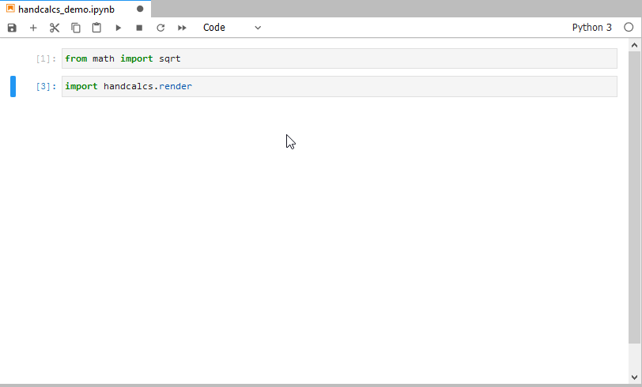

# handcalcs: Python calculations in Jupyter, as though you wrote them by hand.

`handcalcs` is a library to render your python calculation code automatically in Latex, but in a manner that mimics how one might format their calculation if it were written with a pencil:  write the symbolic formula, followed by numeric substitutions, and then the result.

**Intended users**: working engineers, teachers, educators, presenters, and students who want to
focus on simply writing the calculation logic and have the proper formatting magically appear.

## Demos

### Basic Usage


### Exporting to PDF


## Installing

You can install using pip:

`pip install handcalcs`

## Basic Usage
`handcalcs` is intended to be used with either Jupyter Notebook or Jupyter Lab as a _cell magic_.

First, import the module and run the cell:

```python
import handcalcs.render
```

Alternatively, you can load `handcalcs` as a Jupyter extension:

```python
%load_ext render
```

Then, in any cell that you want to render with `handcalcs`, just use the render cell magic at the top of your cell:

```python
%%render
```

For example:

```python
%%render
a = 2
b = 3
c = 2*a + b/3
```

That is it!

Once rendered, you can then export your notebook as a PDF, if you have a Latex environment installed on your system. If you are new to working with Latex and would like to install it on your system so you can use this functionality, please see the section on installing Tex, below.

## Enhanced Usage

`handcalcs` makes certain assumptions about how you would like your calculation formatted and does not allow for a great deal of customization in this regard. However, there are currently **three** customizations you can make using `# comment tags` as the _first line of your cell_ after the `%%render` cell magic. You can only use __one__ comment tag per cell.

* `# Parameters`: `handcalcs` renders lines of code vertically, one after the other. However, when you are assigning variables, i.e. establishing your calculation "parameters", you may not want to waste all of that vertical space. Using the `# Parameters` (also `# parameters`, `#parameters`, `#  Parameters`, etc.) comment tag, your list of parameters will instead render in three columns, thereby saving vertical space.

* `# Output`: In order to render a line of calculations, `handcalcs` relies upon code in the form `parameter = expression`. However, if you just want to display values of a series of parameters that you have previously calculated, you can't create a new expression to assign to them. Using the `# Output` tag (also `#output`, `#out`, or `# Out`) will render all variables in your cell (each individual variable has to be on its own separate line) with their current values.

* `# Long`: To save vertical space, `handcalcs` _attempts_ to figure out how long your calculation is and, if it is short enough, render it out fully on one line. e.g. `c = 2*a + b/3 = 2*(2) + 3/(3) = 5`. If `handcalcs`'s internal test deems the calculation as being too long to fit onto one line, it breaks it out into multiple lines. Using the `# Long` (also `#long` or `#Long`, you get the idea) comment tag overrides the length check and displays the calculation in the "Long" format by default. e.g.

    ```python
    # From this:
    c = 2*a + b/3 = 2*(2) + (3)/3 = 5

    # To this:
    c = 2*a + b/3
      = 2*(2) + (3)/3
      = 5
    ```

### Get Just the Latex Code, without the render
If you just want to generate the rendered Latex code directly to use in your own Latex files, you can use the `%%tex` cell magic, instead:

```python
%%tex
a = 2
b = 3
c = 2*a + b/3
```

Then you can just copy and paste the result into your own .tex document.

## Installing Latex

Printing to PDF requires you to have a Latex environment installed
on your system and to have a Latex compiler available on your system's `PATH` variable so Jupyter can execute `xelatex` on a command line.

Following an installation, you can open up a command line on your system and type `xelatex`. If the installation was successful and complete, the command will enter you into a Latex prompt instead of generating an error message.

### Latex for Windows

Installation on Windows is easiest by installing the TeX distribution, [MiKTeX](https://miktex.org/howto/install-miktex).
After installation, ensure that you allow automatic downloading of required
to make operation easiest.

### Latex for OSX

Installation on Mac OS X is easiest by installing [MacTeX](http://www.tug.org/mactex/mactex-download.html).

Be sure to read the installation page to prevent/assist with any issues.

### Latex for Linux

`$ sudo apt install texlive-latex-extra`
